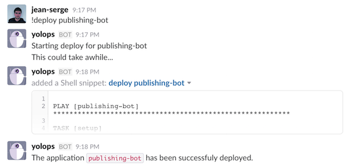

\newpage

# Remerciements

\bigskip

Je tiens tout d'abord à remercier Benjamin Tierny et Robin Komiwes pour m'avoir permis d'effectuer mon stage au sein de leur entreprise puis de m'avoir proposé de prolonger cette expérience.

\bigskip

Je remercie également Julien Iguchi-Cartigny pour l'aide qu'il m'a apporté en tant que tuteur universitaire.

\bigskip

Samy Meftali, mes enseignants et tout le personnel de l'Université de Lille 1 pour la qualité de la formation qu'ils proposent.

\bigskip

Pour finir j'aimerais remercier toute l'équipe de *Dernier Cri* pour m'avoir aidé aussi souvent à étendre mes compétences.

\newpage

# Introduction

\bigskip

Dernier Cri est une Start-Up crée en 2011 axée vers l'innovation digitale. L'équipe est en charge du développement, du déploiement et de la maintenance d'applications pour le compte de plusieurs clients. Ces applications sont hébergées chez des fournisseurs de plateforme (PaaS) ou d'infrastructure (IaaS).

\bigskip

L'entreprise ne disposant pas d'administrateur système, ma mission en son sein consiste à maintenir l'infrastructure utilisée ainsi qu'à être force de proposition pour améliorer celle-ci. Dans ce but, je suis amené à prendre en main et à gérer les différents services souscrit par l'entreprise ainsi qu'à répondre aux demandes des clients au sujet de l'infrastructure.

\bigskip

Mon stage chez Dernier Cri vise donc à proposer différents mécanismes d'automatisation de tâches d'administration de façon à restreindre les interventions de développeur au niveau du système. Cela permet de gagner en maintenabilité et en vitesse de déploiement. Dans cette optique, je suis amené à déveloper un *Chatops*, un outil d'administration d'infrastructure par la discussion qui associé à *Ansible*, un programme d'orchestration de machines, offre une très grande réactivité en cas de panne et une gestion efficace de l'infrastructure.

\newpage

# Contexte du stage

\bigskip


\bigskip

*[Dernier Cri](http://derniercri.io)*, anciennement *Nectify*, est une société d'innovation digitale fondée en 2011 par Benjamin Tierny et Robin Komiwes. À ses débuts, *Nectify* s'est concentré sur le développement de *[Fresc](http://fre.sc)*, un outil de partage d'avis sur des visuels. Par la suite l'activité de l'entreprise s'est étendu à la prestation de services centrée sur l'innovation puis plus récemment au *Big Data* pour devenir. Cette évolution dans les services proposées a motivé le changement de nom pour devenir *Dernier Cri*.

\bigskip

*Dernier Cri* met un point d'honneur à proposer à ses clients une solution complète adaptée à un problème spécifique. De la conception à la réalisation, l'entreprise accompagne ses clients de A à Z pour aboutir à un produit au plus proche des besoins de ceux-ci. Cela permet aux développeurs d'opérer dans différents domaines d'activités et d'avoir une vue globale du développement de produit.

\newpage

# Analyse de l'existant

\bigskip

## Services

\bigskip

Dernier Cri développe des applications pour ses clients et en assure le déploiement continu ainsi que la maintenance. L'entreprise fait appel à plusieurs *SaaS* *(Software as a Service)* pour l'aider dans certaines tâches comme la gestion de *logs* ou l'analyse de code. Ces informations doivent être centralisées et accessibles à l'ensemble de l'équipe, pour cela nous utilisons les intégrations Slack de ces services, de cette manière nous sommes en mesure d'accéder à ces informations en temps réél.

\bigskip

Actuellement ces intégrations consistent uniquement en des rapports envoyés à intervalle réguliers, tandis qu'il faudrait que vous soyons en mesure de les obtenir à la demande pour pouvoir corriger une panne le plus rapidement possible.

\newpage

## Infrastructure

\bigskip

### Serveurs

\bigskip

Nous faisons appel à des *IaaS* *(Infrastructure as a Service)* pour héberger notre infrastructure, ainsi nous profitons de fiabilité et de performances accrues pour nos serveurs. Nous gérons également les noms de domaines pour le compte de nos clients afin qu'ils n'aient pas à s'en soucier.

\bigskip

Le manque d'homogénéité dans l'infrastructure la rend compliquée à maintenir, en effet les serveurs sont hébergés chez 3 fournisseurs différents (*Rackspace*, *OVH*, [*Digital Ocean*](http://digitalocean.com)) et les noms de domaines sont gérés par 2 services différents : *Gandi* pour l'achat et la gestion de certains domaines, [*Cloudfare*](http://cloudfare.com) pour la gestion des autres. Il s'agit là de quelques exemples de ce qui rend l'infrastructure difficile à maintenir.

### Docker

\bigskip

L'utilisation faite de *docker* pose aussi quelques problèmes. Les conteneurs ne sont pas indépendant ni réutilisable, chacun embarque un serveur SSH pour pouvoir démarrer l'application ce qui devrait être fait au démarrage du conteneur.

\bigskip

De plus, les conteneurs contiennent plusieurs services ce qui les rend difficilement réutilisable car trop spécifiques à une application. Il faudrait disposer de conteneurs générique qui pourraient être réutilisable facilement par plusieurs applications, par exemple la plupart des applications utilisent un serveur *Redis* dont l'installation est faite directement dans le conteneur principal. Nous devrions disposer d'un conteneur *Redis* générique prêt à l'emploi pour chaque application.

\newpage

# Objectifs du stage

\bigskip

L'objectif de mon stage consiste à apporter mon soutien à la gestion de l'infrastructure, en réduisant le nombre de services proposant les mêmes fonctionnalités. Je prend également en charge la gestion d'infrastructure et configure les serveurs pour chaque nouvelles application produite par l'entreprise. Cela m'a amené à revoir l'utilisation de *Docker* chez *Dernier Cri* afin d'en améliorer l'efficacité.

\bigskip

Je suis également force de proposition pour faire évoluer l'infrastructure afin de gagner en autonomie et en efficacité, dans ce but j'ai mis en place *Ansible*, un orchestrateur de serveurs afin d'automatiser les tâches d'administration les plus communes comme la configuration de serveurs ou le déploiement d'applications.

\bigskip

J'ai également pu développer un *chatops*, un outil d'administration système via la conversation. Intégré au *Slack* de l'entreprise, il permet à tout le personnel d'obtenir des informations sur un serveur ou une application et d'effectuer des résolutions simples en cas de panne. De plus, en s'appuyant sur *Ansible* et sur un système de plugins, le *Chatops* est une solution générique qui peut facilement s'adapter à l'évolution de notre infrastructure.

\bigskip

En complément des tâches précédentes, j'ai l'opportunité de réaliser du développement pour divers projets ce qui me permet de comprendre davantage le travail de développeur et m'aide à apporter de meilleures solutions d'automatisation.

\newpage

# Ansible

<!--  -->

\bigskip

## Présentation

\bigskip

> Ansible is a radically simple IT automation engine that automates cloud provisioning, configuration management, application deployment, intra-service orchestration, and many other IT needs. *([source](https://www.ansible.com/how-ansible-works))*

\bigskip

Ansible est un outil d'automatisation et d'administration très puissant. Il s'agit d'un serveur léger permettant d'aggréger plusieurs machines (*noeuds*) et d'exécuter sur celles-ci des programmes (*modules*). Le seul prérequis est de disposer d'un point d'accès à ces noeuds.

\bigskip

Il s'agit d'un client léger, il n'est pas nécessaire de l'installer sur un serveur, un simple poste client suffit car l'ensemble des commandes sont exécutées via un protocole de communication, le plus souvent *SSH*. Le résultat d'une commande est également très lisible.

\bigskip

Voici un exemple d'utilisation d'ansible pour vérifier qu'une machine répond :

```bash
$ ansible -i hosts -m ping ssh-test
ssh-test | SUCCESS => {
    "changed": false,
    "ping": "pong"
}
```

\newpage

## Configuration

\bigskip

Ansible permet de gérer une infrastructure hétéroclite de manière transparente en s'appuyant sur la puissance de protocoles de communication tels que *SSH*.

\bigskip

Il est très facile de configurer *Ansible* pour qu'il ait accès à un grand nombre de machines. Sur les serveurs il suffit d'ajouter la clé d'accès du serveur *Ansible*. Il est parfois nécessaire de configurer les règles *sudo* pour qu'*Ansible* puisse exécuter certaines commandes.

\bigskip

Du côté client, il s'agit d'un fichier de configuration qui permet de regrouper les machines disposant de caractéristiques communes. Ainsi il est possible de créer un groupe *cassandra* qui vous permettra d'exécuter les tâches de maintenance et de mise à jour liées à l'ensemble de vos noeuds. Un serveur peut appartenir à plusieurs groupes ce qui permet de configuer des groupes pour chaque type de technologies utilisées

\newpage

## Modules

\bigskip

Il existe beaucoup de modules pour Ansible. Ceux-ci permettent de gérer tout les aspects d'administration système et il existe également des modules correspondant à un grand de nombre de services tels qu'*AWS* ou *Digital Ocean*.

\bigskip

Il est par exemple possible d'écrire un script générique pour créer une machine chez *Digital Ocean* et la configurer afin qu'elle soit prête à l'utilisation le plus vite possible. L'utilisation des groupes évoqués précédemment permettront ensuite d'y installer les dépendances nécessaires.

\bigskip

Ces modules sont très bien documentés et offrent une couche d'abstraction supplémentaires sur la gestion d'arguments pour éviter les problèmes de compréhension. Il est de plus possible, si nécessaire, d'écrire soi-même un module correspondant à un besoin spécifique.

\newpage

## Playbooks

\bigskip

La véritable puissance d'Ansible réside dans la possibilité d'écrire des scripts (*playbooks*) permettant d'exécuter une série de tâches sur un ou plusieurs noeuds de votre architecture, chaque tâche correspondant à un module.

\bigskip

Ci-dessous, un exemple de playbook ansible installant git via *apt*.

```yml
# ping.yml

- hosts: ssh-test
  tasks:
    - name: Install Git
      become: yes
      apt: name=git update_cache=yes
```

And the return of *ansible-playbook* command

\bigskip

```bash
PLAY **********************************************************

TASK [setup] **************************************************
ok: [ssh-test]

TASK [Ping the given hosts] ***********************************
changed: [ssh-test]

PLAY RECAP ****************************************************
ssh-test       : ok=2    changed=1    unreachable=0    failed=0   
```

\bigskip

Les playbboks disposent de multiples fonctionnalités permettant d'automatiser toute sorte de traitement. Il est par exemple possible de définir des variables dans un playbook ou directement dans la définition d'un noeud pour pouvoir utiliser des scripts génériques.

\newpage

## Ansible chez Dernier Cri

\bigskip

L'utilisation d'Ansible au sein de Dernier Cri permet une gestion de l'infrastructure plus claire et plus efficace. La gestion des serveurs et des applications est presque intégralement reléguée à Ansible, ce qui facilite les tâches d'administration système. L'écriture de playbooks génériques rend très facile la création de nouvelles machines, leur configuration et l'installation des dépendances spécifiques pour le déploiement. D'autre playbooks permettront ensuite de maintenir ces machines et d'y déployer une nouvelle version d'une application.

\bigskip

Un autre avantage d'Ansible a été de réduire les accès sur chacune des machines. En effet il était auparavant nécessaire d'ajouter manuellement les clé d'accès *SSH* sur chacune des machines nouvellement créées. Ce processus a amené des problèmes de sécurité, il devenait compliqué de savoir qui disposait d'accès sur quelle machine et certaines anciennes clés était toujours présente dans l'infrastructure.

\bigskip

Grâce à ansible, il est devenu possible de créer une machine supervisant les autres. Ce superviseur gérant l'ensemble des machines de l'infrastructure, celles-ci ne devant disposer que de la clé d'accès du superviseur pour être configurées. La gestion des droits d'accès des différents utilisateurs a donc été réduite à la configuration d'une seule machine, assurant ainsi la scalabilité de l'infrastructure

\bigskip

Pour complèter l'usage d'Ansible, nous mettons également en place un *Chatops* qui permet d'appeler ces scripts directement via le Slack de l'entreprise. Cela nous permet non seulement de pouvoir gérer l'infrastructure directement depuis un smartphone mais cela garantit aussi une certaine sécurité en réduisant les accès directs aux serveurs qui seront uniquement effectuées par le *Bot*.

\newpage

# Chatops

\bigskip

## Présentation

\bigskip

Le chatops est un programme connecté au *Slack* de l'entreprise et couplé à l'infrastructure Ansible permettant de réaliser différentes tâches d'administration système. Il se présente sous la forme d'un utilisateur comme les autres au sein du chat et interagira avec les utilisateurs par le biais de commandes.

\bigskip

Par exemple voici la fonction d'aide intégrée au chatops :


\bigskip

Le chatops a pour but de faciliter les tâches de déploiement et de maintenance des applications, en effet il leur suffit maintenant de saisir des commandes simplifiées dans le canal approprié pour obtenir les informations qui leur sont nécessaires. Le chatops est également capable d'effectuer un diagnostic simple de l'état d'une machine et tentera de résoudre les problèmes.

\newpage

## Fonctionnement

\bigskip

Le chatops fonctionne de manière assez simple, il s'agit d'un programme Node.JS qui se connecte à l'API temps réél de Slack via un Token qui lui est donné. Une fois connecté, le bot recevra tout les messages envoyés dans un channel auquel il appartient, s'il reconnait une commande parmis ces messages, il exécutera la fonction qui lui est associée.

\bigskip

Le format des commandes implémentées est volontairement simplifié afin que même les personnes n'ayant pas de connaissances en informatique soient capable de les comprendre et de les utiliser.
\bigskip

Les commandes sont écrites sous forme de plugins de façon à être configurable et réutilisable, elles peuvent être divisées en 2 catégories : la collecte d'informations et l'exécution de playbooks.

\newpage

### Collecte d'informations

\bigskip

La collecte d'information se traduit par une requête vers l'API de l'un des services utilisé chez Dernier Cri. Cela permet de centraliser les informations concernant un serveur ou une application au sein d'un même canal de communication. Cela s'avère utile en cas de panne, les développeurs peuvent directement sur le chat les informations nécessaire à la résolution du problème telles que les logs de l'application ou l'état de la machine.


\newpage

### Le Chatops et Ansible

\bigskip

L'exécution de playbooks Ansible permet d'agir sur l'infrastructure sans pour autant devoir s'y connecter directement, cela offre une réactivité plus grande et permet de faciliter la résolution d'un problème sans nécessairement disposer de compétences en administration système. L'utilisation de playbook spécifiques à une application permettra de réduire son temps de déploiement sans pour autant augmenter la charge de travail des développeurs.



\newpage

## Le Chatops chez Dernier Cri

\bigskip

Le chatops nous permet d'être plus réactif et efficace en cas de problème, il est désormais possible d'obtenir l'ensemble des informations nécessaires à la résolution d'une panne directement au sein du *Slack* professionnel. De plus tout les développeurs peuvent l'utiliser sans pour autant connaitre les commandes d'administration système à exécuter.

\bigskip

Il représente un gain de temps pour les développeurs en facilitant le déploiement ou la maintenance d'applications. Il n'est plus nécessaire de se connecter au serveur et de retrouver la ou les commandes à exécuter, il suffit de le demander au chatops.

\newpage

# Autres travaux

\bigskip

Durant ce stage j'ai eu l'opportunité de participer à des tâches variées, allant de l'administration système au développement d'applications. Cela m'a permis de me familiariser avec de nouvelles technologies telles que *Ruby* ou *Node.JS* mais également de renforcer mes compétences dans certains domaines tels que les script *bash* ou le multi-processing *python*.

## Administration système

\bigskip

Au sein de *Dernier Cri* j'ai le rôle d'administrateur système, je suis en charge de la gestion de l'infrastructure qu'il s'agisse de serveurs, des services externes en passant par la gestion des noms de domaine et des certificats. Ces responsabilités m'ont permis de prendre conscience des nombreux aspects à prendre en compte avant même le développement d'une application web.

\bigskip

Je suis également amené à revoir l'utilisation de *docker* au sein de l'entreprise, celle-ci est maladroite et peut être amélioré. Les conteneurs actuels contiennent systématiquement un serveur *SSH* indépendant pour pouvoir démarrer l'application conteneurisée ce qui consomme des ressources inutilement. Pour corriger cela il suffit de rédiger un script qui sera exécuté au démarrage du conteneur, de cette manière il n'est plus nécessaire de se connecter au conteneur pour démarrer l'application.

\bigskip

Les images utilisées peuvent aussi être allégées en réécrivant le *Dockerfile* utilisé et en y retirant les fichiers inutiles (cache, doc, ...). De plus il convient généralement de n'inclure qu'un seul service par *Docker* ce qui est plus sécurisé mais surtout réutilisable. Certains services sont actuellement inclus dans plusieurs conteneur alors qu'il suffirait de créer une image indépendante et de l'utiliser lors du déploiement.

\newpage

## Développement

\bigskip

J'ai pu travailler sur un projet en *python* effectuant un grand nombre de requêtes API suivi d'un traitement sur la réponde de celle-ci. Le nombre de requêtes étant élevée et les informations récupérées n'étant pas inter-dépendantes j'ai écrit un programme créant 8 sous-processus réalisant cette tâche.

\bigskip

Suite au *Chatops* j'ai eu l'occasion de travailler sur d'autre *bots*, un *chatbot* et le *publishing-bot*.

\bigskip

Le *chatbot* est semblable au *chatops* mais a pour but d'exécuter des tâches internes à l'entreprise telles que la saisie des temps ou les réservations de local et de matériel.

\bigskip

Le *publishing-bot* est un *bot* écrit en *Ruby* capable de convertir un répertoire Github sous forme de PDF, d'HTML ou d'Epub puis de le publier. Ce bot est utilisé pour publier les documents de l'entreprise puis, grâce au *chatbot*, d'envoyer un message sur le *Slack* de l'entreprise indiquant l'URL pour accéder à ces documents.

\newpage

# Conclusion

\bigskip

La mise en place d'Ansible et du Chatops chez Dernier Cri est un premier pas vers l'automatisation de l'infrastructure. Actuellement certaines application sont encore inadaptée à ce système, l'objectif sur le long terme est donc de les rendre compatible en révisant leur méthode de déploiement et de maintenance.

\bigskip

Mon prochain objectif au sein de Dernier Cri est d'apporter mon soutien dans l'amélioration de l'infrastructure Docker de l'entreprise, celle-ci est en effet assez simpliste est pourrait être revue afin de faciliter le déploiement d'application mais aussi la préparation d'environnement de développement. Cela a déjà été mit en place sur certaines applications et je souhaite poursuivre cette tendance.

\bigskip

Sur le plus long terme j'espère apporter davantage de mécanismes d'automatisation à *Dernier Cri* pour rendre le déploiement d'application le plus rapide et simple possible.

\bigskip

Ce stage m'a beaucoup apporté en terme de techniques comme social. Il m'a permis de m'intégrer au sein d'une équipe de développement et d'en apprendre davantage sur le fonctionnement d'une entreprise informatique.

\bigskip

Mon intégration au sein de *Dernier Cri* m'a offert l'opportunité de participer à de nombreuses tâches et m'a conforté dans mon projet professionnel visant à travailler en tant que *devops* dans une petite structure.
